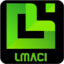

#  Lmaci

**Lmaci project** is used to build the **Limac** web application about [e-commerce](https://en.wikipedia.org/wiki/E-commerce).

This project use [MEAN](https://en.wikipedia.org/wiki/MEAN_(solution_stack)) ([MongoDB](https://en.wikipedia.org/wiki/MongoDB), [Express.js](https://en.wikipedia.org/wiki/Express.js), [Angular](https://en.wikipedia.org/wiki/Angular_(application_platform)) and [Node.js](https://en.wikipedia.org/wiki/Node.js)).
